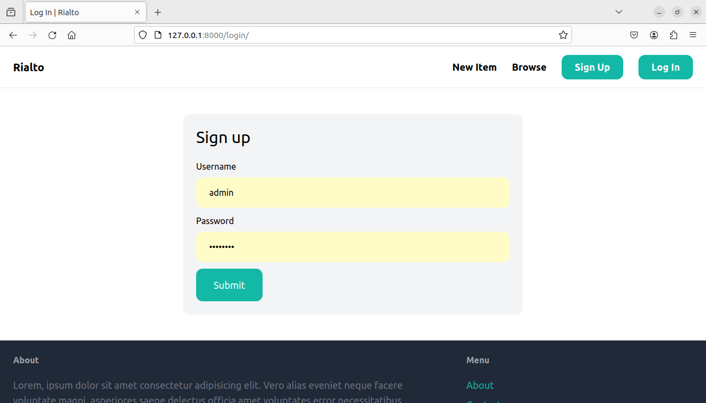

# Rialto: An Online Marketplace

This app is a basic backend implementation of an online marketplace. Users can sign up, then post products they want to sell, or search for the product they want to buy. The app also provides ability to Chat with other users for further discussions on a product.

This app uses Django's Authentication System to provide basic authentication abilities. Also, Tailwind CSS is used for UI.

## Steps to setup project
Clone the Repository:

``` git clone https://github.com/00AR/rialto.git ```

To install the dependencies, open rialto directory in the terminal and run the command:

``` python -m pip install requirements.txt ```

## Screenshots
- Products Page

- Conversation Page

- Login/Signup Pages
